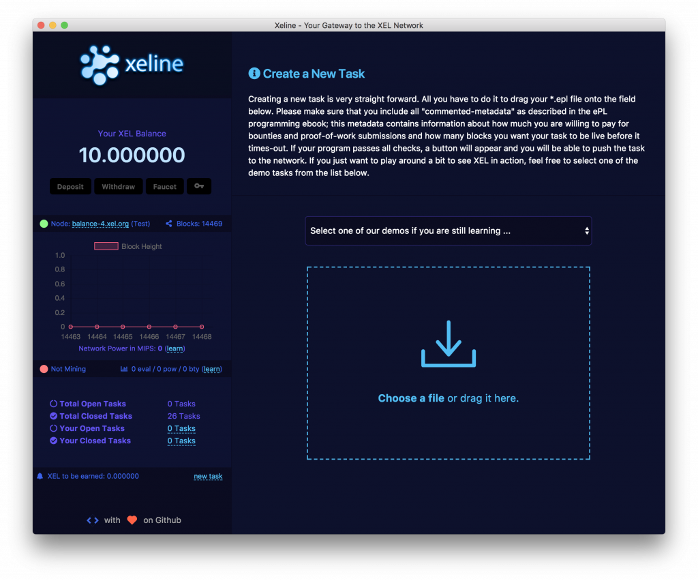
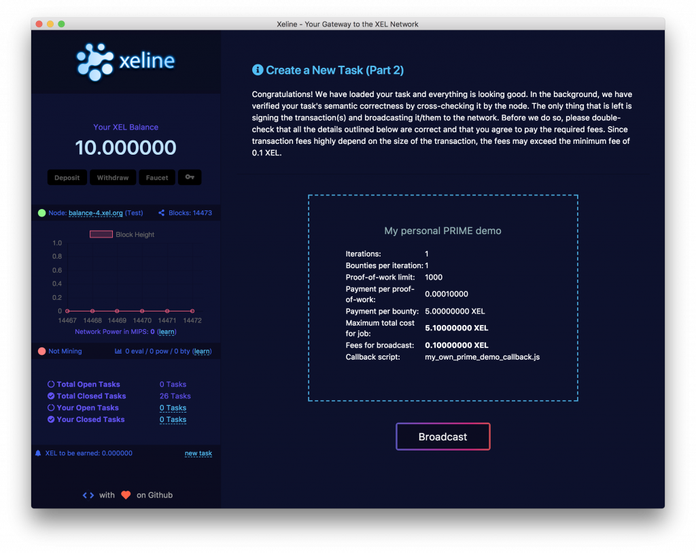
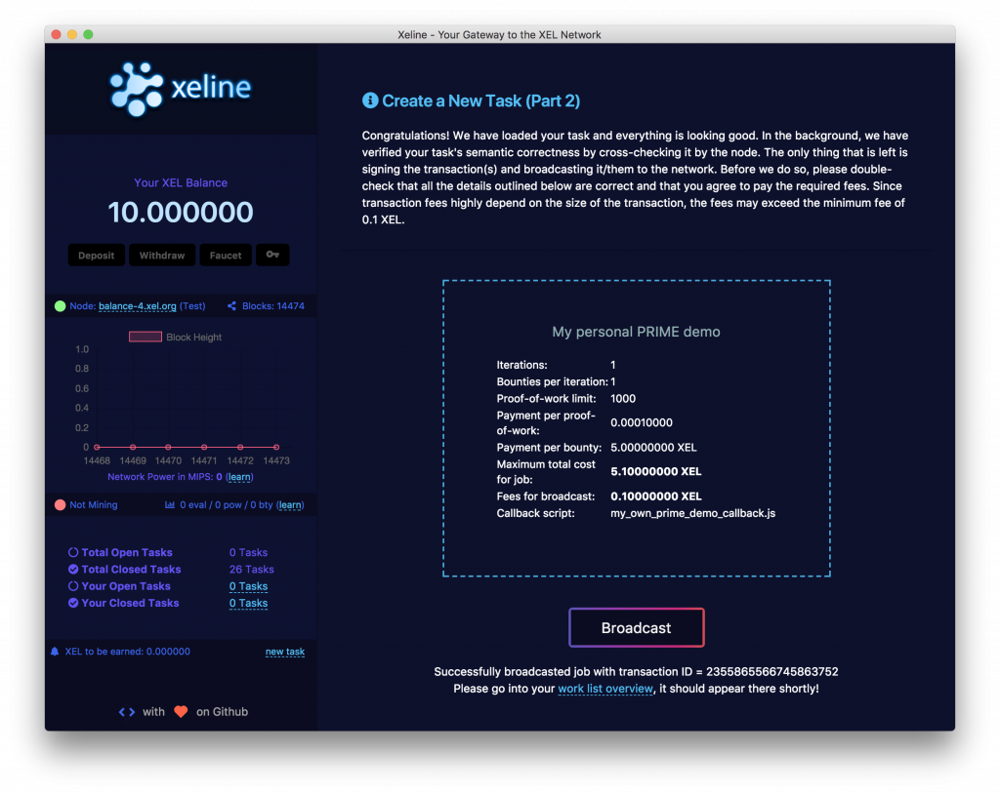
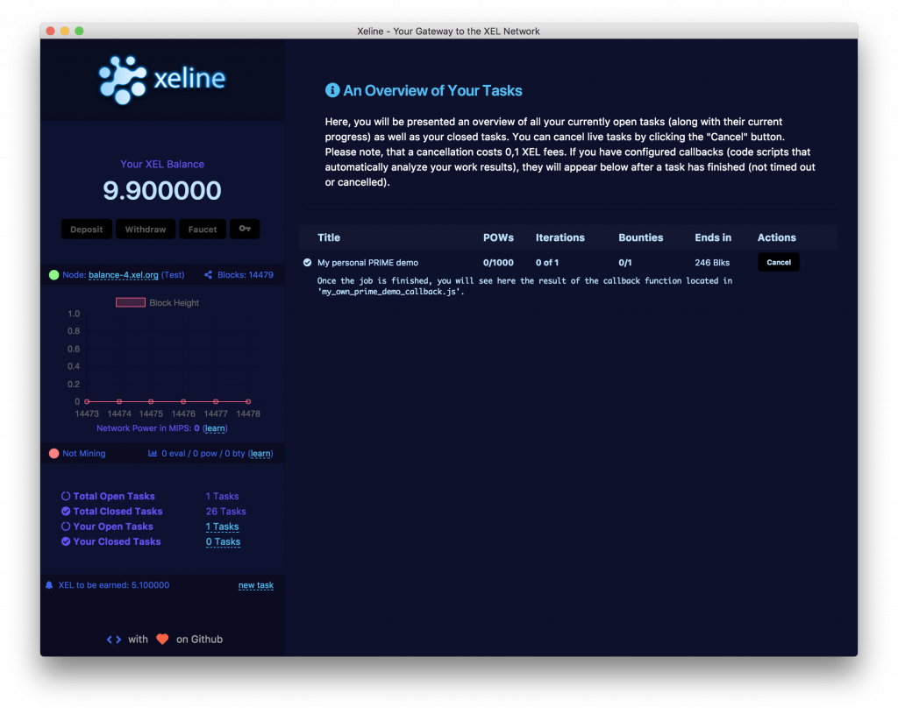
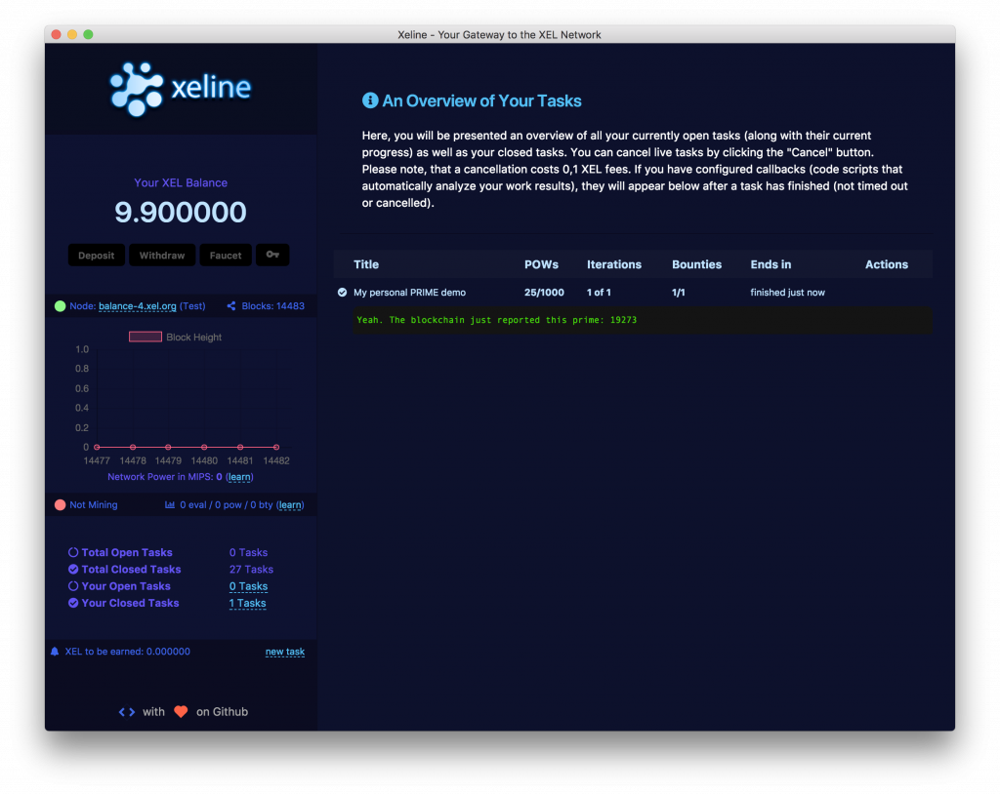

# Part 2: Broadcast to the Blockchain
## Preparing Your ePL File

We will use the demonstration task that we've created in step 1 of this tutorial. Save it to a file called “my_own_prime_demo.epl”. While this demo is already integrated into the Xeline wallet and can be run right away, we want to create this demo project from scratch here so you can learn and understand every single step involved. At this moment, your ePL file contains just the program logic. However, to submit it to the Blockchain you have to configure a few parameters which we can “metadata. Those parameters tell Xeline how much you are willing to spend for that job, how long it is meant to be running, how many solutions you are interested in, how many iterations your job is meant to run, and so on. We have not yet covered the iteration part, we save that for later. Metadata is added to your ePL file at the top. So go ahead, an add those lines to the top of your ePL program:

```
// metadata(title:My personal PRIME demo)
// metadata(pow_limit:1000)
// metadata(pow_price:0.02)
// metadata(bounty_limit:1)
// metadata(bounty_price:5)
// metadata(iterations:1)
// metadata(timeout:250)
// metadata(callback:my_own_prime_demo_callback.js)
```

Let us break this up and take a deeper look at what these lines do:

```
// metadata(title:My personal PRIME demo)
```

This line gives your job description. Try to keep it as short as possible. This title is just used to help you organize tasks inside the Xeline wallet, and it won’t be transmitted to the Blockchain.

```
// metadata(pow_limit:1000)
// metadata(pow_price:0.0001)
```

These two lines describe how many proof-of-work rewards you want to give out before your job times out and closes automatically. Remember: these are continuous small rewards workers keep getting as a targeted frequency of 10 proof-of-work / second (for the all tasks in the network together). So in our case, we want to close our job if we have paid 1000 proof-of-work rewards for 0.0001 XEL each and the network has not yet found a solution to our problem.

```
// metadata(bounty_limit:1)
// metadata(bounty_price:5)
```

These two lines describe how many solutions you want for your problem. In our case, we are looking for just one prime number, so we set this value to 1. Also, we are willing to pay a “bounty price” of 5 XEL for the first submitted solution to our problem. If multiple solutions are submitted inside one block, only the one appearing first in the block transaction list will count. This can happen for the very simple reason that the work closing and timeout events are triggered after the block has been processed. So when your job receives a solution in block 1000, it will be closed in block 1001. However, since we can never be sure which unconfirmed transactions will make it into the next block, we cannot close the job after the first solution is put into the unconfirmed transaction cache at block height 1000. This, however, should be not of your concern. This affects “workers” who have submitted a bounty solution and wonder why they have not been rewarded.

```
// metadata(iterations:1)
```

This line tells Xeline how many iterations you want your program to run. The concept of iterations will be explained in one of the next blog posts: we leave it at 1 for now, which means that your program ends immediately after #bounty_limit solutions have been found.

```
// metadata(timeout:250)
```

This line tells Xeline after how many blocks you want to end your task regardless of how many proof-of-work or bounty solutions have been found. This is useful when you, for example, create tasks with time-critical results. In this example, we just set this value to a random 250 which means that the job will end after 250 blocks from the block it gets included in.

```
// metadata(callback:my_own_prime_demo_callback.js)
```

This line is probably the most important one since it will help you to analyze and post-process the results the worker nodes find automatically. Remember, as you have seen in the ePL programming guide, solutions are determined by 12 pseudorandom integers stored in the internal uint m[12]; array. Depending on how complicated the way you derive your solution candidates from is, it may be close to impossible to extract your actual solution from just looking at this array. This is the job of our so-called callback.

However, specifying the callback in the metadata is not enough, we need to create that file in the correct location. The directory where callback scripts should be placed into varies by operating system:

####MacOS

```
~/Library/Application Support/Xeline/callbacks
```

####Windows

```
C:\Users\<YourUserName>\AppData\Local\Xeline\callbacks
```

####Linux

```
~/.config/Xeline/callbacks
```

So, if you are on a macOS system you have to create the following file for this demo to run:

```
~/Library/Application Support/Xeline/
          callbacks/my_own_prime_demo_callback.js
```

Callbacks are written in NodeJS and are only executed on your local computer. As said before, they are meant to post process your solution candidate for display. Practically, the Xeline wallet will run this file once a solution has been submitted to the Blockchain and display the console output in your task overview. Of course, your callback can do all sorts of other stuff like, for example, submit your result over the network or feed it into another application. For now, just put this line into the file:

```
console.log("Yeah. The blockchain just reported
             this prime: " + (bounties[0][0]>>>0));
```

Within your callback script, you can access a two-dimensional array called bounties[][]. The first dimension holds all solutions that were submitted, and the second dimension holds the 12 m[] values that led to this solution. Since we are only looking for one solution only, our bounty array will have just one entry containing twelve unsigned integers:

```
var bounties = [ [m[0],m[1],m[2],...m[11]] ];
```

Since our prime number candidate is just in m[0] (if you do not understand this, reread the ePL programming guide) it is enough for us to print out bounties[0][0], i.e., the first m value in the first (and only) solution.

There is a second, one-dimensional array that you can access, the storages[] array which contains the latest version of the storage integers. Since we have not yet used the concept of iterations and storages, this array will be empty and should not be accessed in this demo.

## Submitting Your Task to the Blockchain

Now, it’s time to submit your task to the Blockchain. To do so, click on “new task” in the lower part of the left-hand side to go to the “New Task” screen:



Now, simply drag your “my_own_prime_demo.epl” file onto the drag-drop field:



You will see a confirmation screen where you can once again verify that all the metadata you have configured earlier has been picked up correctly. Also, this step will inform you in case you have not put your callback script in the proper location. By clicking the “Broadcast” button, you can submit your task to the Blockchain. You will see this confirmation message, showing the transaction ID and advise you to switch over to your task overview:



Click on “work list overview” or on “xx tasks” in the left sidebar to switch to the task overview:



It might happen, that your task does not appear immediately because it needs at least one confirmation on the Blockchain. Just hang on for a minute, it should appear eventually. You will see your task which comes with some basic statistics such as the amount of proof-of-work submissions received so far, the number of bounties (or solutions) that have been found so far, the iteration this job is in and the remaining blocks until the job times out. Additionally, for open tasks, you see a “Cancel” button which allows you to stop that job at any time. Below the task statistics, you see a message saying, that a callback will be executed the moment the job is finished: this is where the results of your task will appear.

So this is how it looks like after your job has finished and your callback has been executed:



Congratulations! You have successfully created your first job in ePL, submitted it to the Blockchain, received a result that has been found by a “miner” and automatically analyzed the result within your callback.
