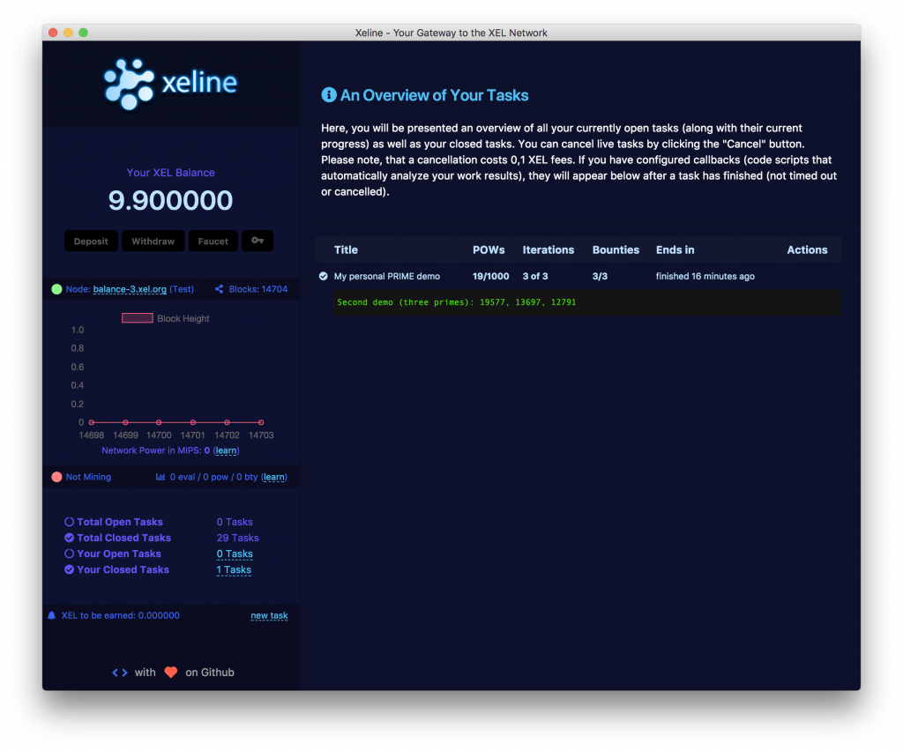

# Part 3: Storage and Iterations
## Limitations of the Original Demo

Our original demo was capable of finding prime numbers between 10000 and 20000. However, there was no way so far on re-using results that have been submitted by other nodes to improve on them. This behavior is for example necessary for Genetic Algorithms. Genetic Algorithms typically use heuristics similar to natural evolution processes like selection and mutation. Candidate solutions to problems that have large search space are then evolved over multiple generations (or iterations, as we would call them). In each generation, the good results of the previous generation are taken and improved causing the Algorithm to converge towards some optimum.

This requires some sort of storage and synchronization between consecutive iterations/generations. We will try to keep things simple in this tutorial for a better understanding. In this tutorial, we want to extend our prime finding demo for it to be able to find multiple primes over multiple iterations, with each prime being smaller than the prime found in the prior iteration.

In order to do so, we adjust our demo to look like this:

```
// metadata(title:My personal PRIME demo)
// metadata(pow_limit:1000)
// metadata(pow_price:0.2)
// metadata(bounty_limit:1)
// metadata(bounty_price:5)
// metadata(iterations:3)
// metadata(timeout:250)
// metadata(callback:my_own_prime_demo_callback.js)

array_uint 1000;

submit_sz 1;
submit_idx 100;

function main { verify();}
function primetest {
    u[1] = 0;
    if (u[2] <= 1)  u[1]=0;
    else if (u[2] <= 3) u[1]=0;
    else if (u[2]%2 == 0 || u[2]%3 == 0) u[1]=0;
    else {
       u[3]=5; u[1]=1;
       repeat(u[99],20000,20000){
          if (u[2]%u[3] == 0 || u[2]%(u[3]+2) == 0)
          { u[1]=0; break; }
          if(u[3]*u[3] > u[2]) break;
                  u[3]+=6;
       }
    }
}

function verify {
    // make prime test
    u[2] = m[0];
    u[1]=0;

    // take over a possible prime stored in s[] storage_idx
    u[4]=s[0];
    u[100]=u[2];

    if(m[0]>10000 && m[0]<20000 && (u[4]==0 || m[0]<u[4]))
    primetest();
    // Bounty Is Rewarded:
    // m[0] is larger than 3294967295 and prime
    verify_bty ((m[0]>10000 && m[0]<20000) && (u[1]==1));

    // some randomness for POW function
    u[57] = m[1];
    u[56] = m[2];
    u[55] = m[3];
    u[54] = m[4];

    verify_pow (u[57], u[56], u[55], u[54]);
}
```

Now, let’s quickly go through the differences:

```
// metadata(iterations:3)
```

This line tells Xeline that we now want three iterations instead of one. The number of solutions (per iterations), in this demo, has been left at one.

```
submit_sz 1;
submit_idx 100;
```

These lines describe that we want a storage size of 1 unsigned integer. When a solution is found, we want the miner to upload submit_sz amount of unsigned integers beginning at u[submit_idx] = u[100].

```
// take over a possible prime stored in s[] storage_idx
u[4]=s[0];
u[100]=u[2]; // prepare the slot for upload
```

In this part, we initialize a free slot in the u-array u[4] with the first and only storage value s[0]. Now, this may sound confusing, so once again. When solutions are found, the miner software submits submit_sz unsigned integers starting from u[submit_idx]. When other miners receive work, that earlier submitted storage is stored in an array called s[] which also has the size of submit_sz. In our case, this means that the value at u[100] (which is initialized with the prime in the code snippet above) is submitted with every solution, and down streamed into s[0] in consecutive iterations. If you have multiple solutions per iteration configured, a random one of those is going to be put into s[0]. This, however, is not the case for this simple demo.

These lines here were also modified:

```
if(m[0]>10000 && m[0]<20000 && (u[4]==0 || m[0]<u[4]))
  primetest();
```

On the first iteration, the storage is filled with zero values, and on consecutive iterations, the storage has the value of the previous iteration. What these two lines do is only to run the prime test in case there is no storage yet, or if the prime number in question is smaller than the one submitted to the storage in the previous iteration.

Now, the only thing we have to do, is account for it inside our callback. Since we have three bounties in total, we can just iterate over the first dimension in the bounties array (as described in one of the earlier tutorials):

```
var txt = (bounties[2][0]>>>0)+", " +(bounties[1][0]>>>0);
txt +=  ", " +  (bounties[0][0]>>>0);
console.log("Second demo (three primes): " + txt);
```

After you run this in Xeline, you see this result:



You see that three primes have been found and, by using storage and iterations, every prime number is smaller its predecessor. With the knowledge you have got so far, you can now start programming fancy, multi-iteration tasks for XEL.
