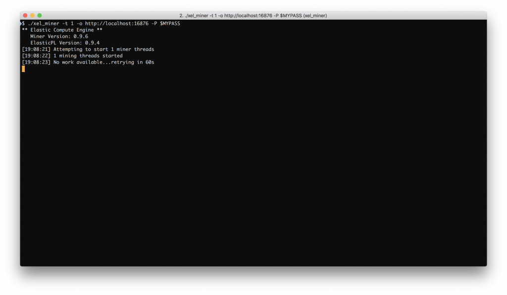
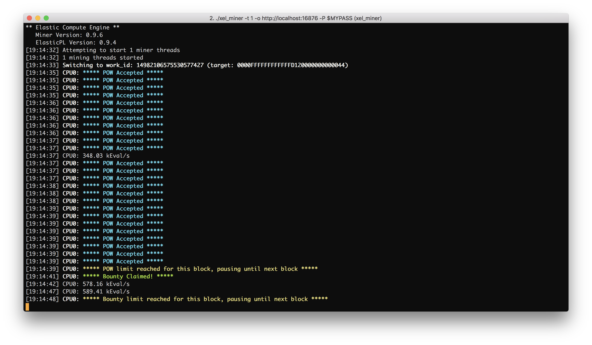

# Part 4: Using the Mining Software

## Using the Miner

Please install the miner first according to the installation manual. Make sure you open up a console and change into the directory where your xel_miner executable is. It is always a good start to have a look at the help information xel_miner provides:

On Linux and macOS, that would be

```
./xel_miner --help
```

On Windows

```
xel_miner.exe --help
```

In the remainder of this tutorial, we will cover the Linux/macOS variant, but the Windows one should always be analogous to that.

We will not cover all options in this tutorial, only those which are required to get your miner ready to work on tasks on the XEL Blockchain. First of all, we want to take a look at the threads configuration parameter:

```
-t, --threads  Number of miner threads (Default: Number of CPUs)
```

This parameter allows you to configure how many threads you want xel_miner to run on. The more threads you use, the faster xel_miner finds solutions. However, if you set this number too high, then your system may become unresponsive.

The next parameter we want to look at is the URL configuration:

```
-o, --url=URL   URL of mining server
```

This allows you to point the miner to either a remote node or a local node. Either way is excellent, but keep in mind that remote URLs do leak your private key to the server at the moment. If you do not trust the remote node, stick to a local one instead. The URL is always given in the form of http://hostname:port where hostname is the IP or FQDN of the host, and port is either 17876 for the main net or 16876 for the test net.

The third important parameter is the passphrase flag:

```
-P, --phrase   Secret Passphrase for Elastic account
```

This is essential as it specifies the passphrase to the account which will both pay the transactions fees for submitting work results and receive the rewards in exchange. If your passphrase has a space in it, make sure to put double quotes around it. It is essential that you have some initial funds inside this account or you will not be able to submit any solutions. For testing purposes, you can use your 12-word Xeline mnemonic code (enclosed in double quotes) since it’s straightforward to get some XEL from the faucet to get started.

Now, for this tutorial, we want to launch a miner running just one thread, mining via our local node on the test net. Hence, we start it like this:

```
./xel_miner -t 1 -o http://localhost:16876
            -P "our twelve-word passphrase goes here"
```

If you prefer using one of the public nodes, feel free to use one of the balancer nodes instead:

```
./xel_miner -t 1 -o http://balance-1.xel.org:16876
            -P "our twelve-word passphrase goes here"
```

When there is no work on the network, you should see something like this:



If this is the case, you should maybe work through one of the other tutorials and post some work to the Blockchain. If you have done so, you should see the miner pick up on your work pretty quickly:



The first line means that the maximum number of allowed POWs for this block has already been reached in the unconfirmed transaction cache and there is no need to submit more until the next block arrives. We already know that the retargeting algorithm tries to calibrate the target value so that 10 proof-of-work submissions (on average) are found per minute. This is not per task but for all tasks in the network together. However, as a DOS precaution, there is a hard cap of 25 proof-of-work submissions per block. Once that number is reached, no more proof-of-work submissions are accepted until the next block is found.

The bounty limit behaves similarly. In this scenario, we have a job that takes one bounty per iteration and runs for three iterations. Since one iteration corresponds to at least one full block, there is no need to submit more than one bounty per block. So once a bounty has been found (in this case, this can be more for other tasks), we have to wait until the iteration count increases by one in the next block.

You do not need to monitor the console output continuously. If you launch Xeline, you can see a few basic mining statistics in the left sidebar. Now, you are ready and set to start mining – be it your own tasks for testing purposes or other tasks for some XEL in exchange.
